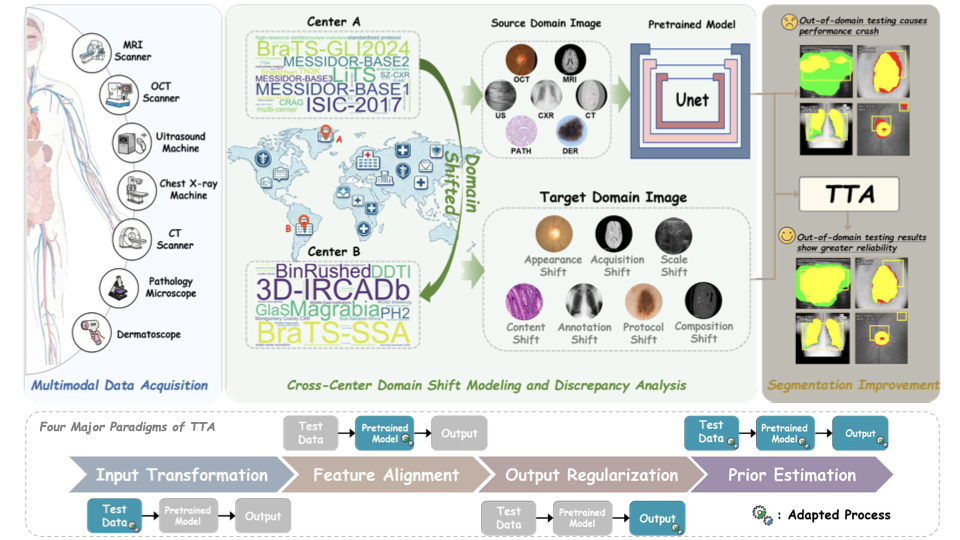
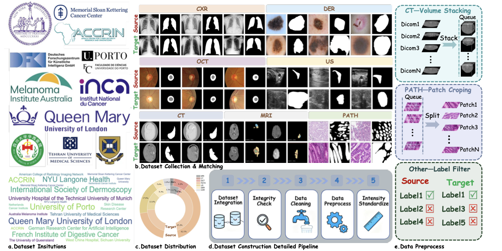

# A Large Scale Benchmark for Test Time Adaptation in Medical Image Segmentation

[](https://github.com/wenjing-gg/MedSeg-TTA)
[](#)
[](#)
[](https://wenjing-gg.github.io/MedSeg-TTA/)
[](#)

MedSeg-TTA is an open benchmark for evaluating test-time adaptation (TTA) methods in medical image segmentation. It standardizes data, metrics, and protocols across modalities, organs, and tasks, enabling fair and reproducible comparisons under strict constraints (fixed backbone, no source-domain access, and no implicit leakage).



## Main Contributions

- Multi-modal and multi-center open-source dataset: We construct a dataset that covers tumor, organ, and lesion segmentation across seven imaging modalities, namely MRI, CT, US, PATH, DER, OCT, and CXR. The dataset employs standardized preprocessing and partitioning, faithfully reflecting distribution shifts across institutions, scanners, and populations, thereby providing a data foundation for the unified TTBA benchmark.
- Strong baselines and SOTA reproduction: Under a unified TTBA setting that fixes the backbone and forbids source-domain access as well as any implicit leakage, we systematically reproduce and validate twenty state-of-the-art TTA methods across four paradigms, delivering readily usable strong baselines and reproducible scripts. We also establish a public leaderboard that enables comparisons across modalities, organs, and tasks using region-consistency and structure-sensitive metrics such as Dice and HD95.
- Paradigm taxonomy and applicability lineage: We categorize TTA methods into four paradigms according to their locus of operation and, based on evaluations across modalities, organs, and tasks, construct lineage maps that highlight effective and ineffective regimes. This delineates applicability boundaries and provides practical guidance for future method selection.



## Source–Target Dataset Pairs and Downloads

After aligning class definitions between source and target domains, “Binary” tasks have a foreground–background split, while “4-Class” tasks include the background plus three anatomical classes. The Reprocess column uses ✓ to indicate standardized reprocessing and ✗ for original data.

| Modal | Dataset | Domain | Category | Quantity | Year | Reprocess | Source |
| --- | --- | --- | --- | --- | --- | --- | --- |
| MRI | BraTS-GLI2024 | Source | 4-Class | 1k–2k | 2024 | ✗ | [Link](https://www.synapse.org/Synapse:syn59059776) |
| MRI | BraTS-SSA | Target | 4-Class | 60 | 2023 | ✗ | [Link](https://www.synapse.org/#!Synapse:syn51514109) |
| CT | LiTS | Source | Binary | <0.5k | 2017 | ✓ | [Link](https://competitions.codalab.org/competitions/17094) |
| CT | 3D-IRCADB | Target | Binary | 20 | 2010 | ✓ | [Link](https://cloud.ircad.fr/index.php/s/JN3z7EynBiwYyjy/download) |
| Dermoscopy | ISIC-2017 | Source | Binary | 2k–3k | 2017 | ✗ | [Link](https://challenge.isic-archive.com/data/#2017) |
| Dermoscopy | PH² | Target | Binary | <0.5k | 2015 | ✗ | [Link](https://www.dropbox.com/s/k88qukc20ljnbuo/PH2Dataset.rar) |
| Ultrasound | TN3K | Source | Binary | 2k–3k | 2021 | ✗ | [Link](https://github.com/haifangong/TRFE-Net-for-thyroid-nodule-segmentation) |
| Ultrasound | DDTI | Target | Binary | 0.5k–1k | 2015 | ✗ | [Link](http://cimalab.intec.co/applications/thyroid/) |
| X-Ray | SZ-CXR | Source | Binary | 0.5k–1k | 2018 | ✗ | [Link](https://www.kaggle.com/datasets/raddar/tuberculosis-chest-xrays-shenzhen) |
| X-Ray | Montgomery | Target | Binary | <0.5k | 2021 | ✗ | [Link](https://openi.nlm.nih.gov/imgs/collections/NLM-MontgomeryCXRSet.zip) |
| Fundus | RIGA+ (MES) | Source | Binary | <0.5k | 2021 | ✓ | [Link](https://github.com/mohaEs/RIGA-segmentation-masks/raw/main/RIGA_masks.zip) |
| Fundus | RIGA+ (MB) | Target | Binary | <0.5k | 2021 | ✓ | [Link](https://github.com/mohaEs/RIGA-segmentation-masks/raw/main/RIGA_masks.zip) |
| Histopathology | CRAG | Source | Binary | <0.5k | 2019 | ✓ | [Link](https://github.com/XiaoyuZHK/CRAG-Dataset_Aug_ToCOCO) |
| Histopathology | Glas | Target | Binary | <0.5k | 2017 | ✓ | [Link](https://academictorrents.com/details/208814dd113c2b0a242e74e832ccac28fcff74e5) |


## Getting Started

1. Install the package metadata:

  ```bash
  pip install -e .
  ```

2. Install the runtime dependencies needed by the local legacy method entrypoints:

  ```bash
  pip install -e .[runtime]
  ```

  The `runtime` extra currently includes the medical-imaging packages needed by the unified entrypoints, including `monai`, `dynamic-network-architectures`, `medpy`, `opencv-python-headless`, and `SimpleITK`.

3. Inspect the canonical method registry:

  ```bash
  python -m medseg_tta list-paradigms
  python -m medseg_tta list-methods --flat
  python -m medseg_tta show-method grata
  python -m medseg_tta show-method prosfda --dimension 3d
  python -m medseg_tta validate-structure
  ```

4. All runnable wrapper entrypoints are grouped by paradigm first, then by method name, and dimension-specific entrypoints live inside `two_d/` and `three_d/`.

5. Open the public MVP leaderboard:

  ```text
  https://wenjing-gg.github.io/MedSeg-TTA/
  ```

## Leaderboard

The GitHub Pages MVP leaderboard lives at `https://wenjing-gg.github.io/MedSeg-TTA/`. It keeps the benchmark tables in a web format and adds direct jumps from local-method entries back into the corresponding repository folders.
After GitHub Pages is enabled once in the repository settings with `GitHub Actions` as the source, pushes to `main` will redeploy this site automatically through `.github/workflows/deploy-pages.yml`.

## Repository Layout

```text
MedSeg-TTA/
├── medseg_tta/
├── site/
├── feature_level_alignment/
│   ├── GraTa/
│   └── Testfit/
├── input_level_transformation/
│   └── SFDA-FSM/
├── output_level_regularization/
│   ├── DG-TTA/
│   ├── SaTTCA/
│   └── tent/
└── prior_estimation/
    ├── ExploringTTA/
    └── ProSFDA/
```

## Execution Commands

Add `--help` first, then replace it with real dataset and checkpoint arguments when you are ready to run.

### Core Commands

```bash
python -m medseg_tta list-paradigms
python -m medseg_tta list-methods --flat
python -m medseg_tta show-method grata
python -m medseg_tta show-method prosfda --dimension 3d
python -m medseg_tta validate-structure
python -m medseg_tta run-legacy grata_3d tta3dCT.py --help
```

### Representative Entrypoints

```bash
python feature_level_alignment/GraTa/two_d/tta2d.py --help
python feature_level_alignment/GraTa/three_d/tta3dCT.py --help
python feature_level_alignment/Testfit/two_d/tta2d.py --help
python feature_level_alignment/Testfit/three_d/tta3dCT.py --help
python input_level_transformation/SFDA-FSM/two_d/tta2d.py --help
python input_level_transformation/SFDA-FSM/three_d/tta3dCT.py --help
python output_level_regularization/DG-TTA/two_d/tta2d.py --help
python output_level_regularization/DG-TTA/three_d/tta3dCT.py --help
python output_level_regularization/SaTTCA/two_d/tta2d.py --help
python output_level_regularization/SaTTCA/three_d/tta3dCT.py --help
python output_level_regularization/tent/two_d/tta2d.py --help
python output_level_regularization/tent/three_d/tta3dCT.py --help
python prior_estimation/ProSFDA/two_d/tta2d.py --help
python prior_estimation/ProSFDA/three_d/tta3dCT.py --help
python prior_estimation/ExploringTTA/three_d/tta3dCT.py --help
```

## Citation

If you find this project useful, please cite:

```
@article{MedSeg-TTA,
  title   = {MedSeg-TTA: Benchmarking Test-time Adaptation Methods for Domain Shift in Medical Image Segmentation},
  journal = {arXiv preprint arXiv:xxxx.xxxxx},
  year    = {2025}
}
```

## Links

- Repository: https://github.com/wenjing-gg/MedSeg-TTA
- Paper (arXiv): coming soon
- Leaderboard: https://wenjing-gg.github.io/MedSeg-TTA/

## License

This project is released under the MIT License. See `LICENSE` for details.

<!-- MEDSEG_TTA_CODE_RELEASE_START -->

## Code Release

This repository now includes a paradigm-organized Python package for the locally available MedSeg-TTA method implementations, excluding RSA by request. The package keeps canonical method metadata in `medseg_tta.registry`, provides `python -m medseg_tta list-paradigms`, `python -m medseg_tta list-methods`, and stores sanitized method code under `medseg_tta/methods/<paradigm>/<method>/two_d|three_d|common`.

The MVP leaderboard source for GitHub Pages lives in `site/` and is deployed from `main` via `.github/workflows/deploy-pages.yml`.

Paradigm directories:

- `medseg_tta/methods/input_level_transformation/`
- `medseg_tta/methods/feature_level_alignment/`
- `medseg_tta/methods/output_level_regularization/`
- `medseg_tta/methods/prior_estimation/`

Legacy wrapper entrypoints now follow the canonical outer-directory layout, for example:

- `output_level_regularization/DG-TTA/two_d/tta2d.py`
- `feature_level_alignment/GraTa/three_d/tta3dCT.py`
- `prior_estimation/ProSFDA/two_d/prosfda/inference/run_inference.py`
- `output_level_regularization/tent/three_d/tta3dCT.py`

Registry aliases are retained for `grata_3d`, `prosfda_2d`, and `prosfda_3d`, but the old top-level directories `GraTa-3d`, `ProSFDA2D`, and `ProSFDA3D` are removed.

<!-- MEDSEG_TTA_CODE_RELEASE_END -->
